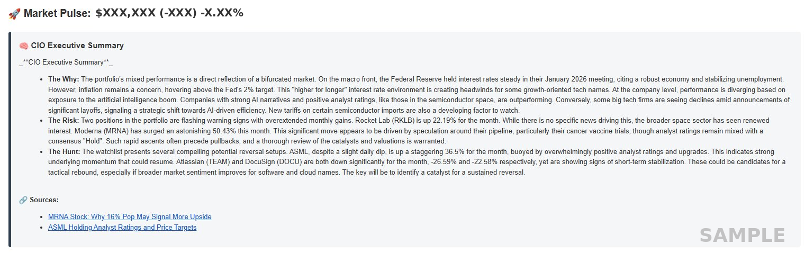
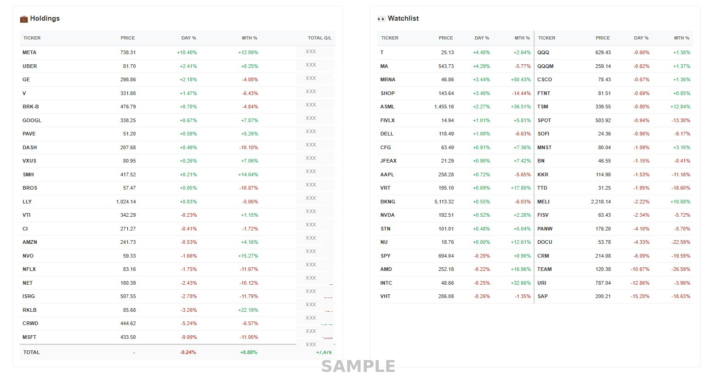
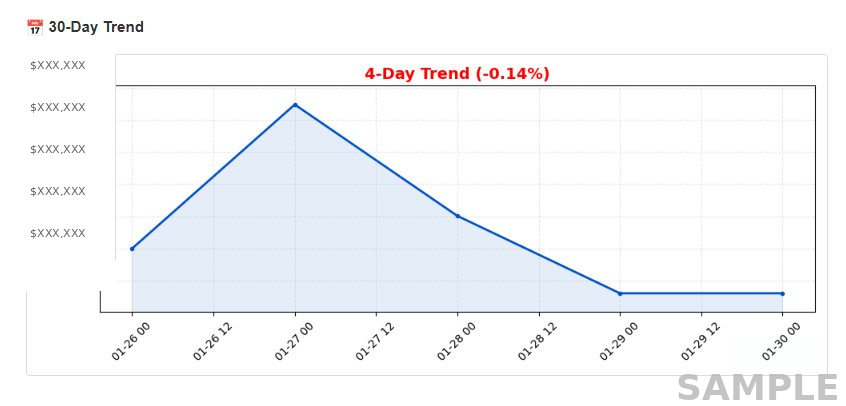

# 📈 AI Market Pulse Agent (Gemini 2.5 Pro Edition)

A serverless, AI-driven investment operations center that monitors your portfolio, analyzes market drivers using **Google Gemini 2.5 Pro**, and delivers "Hedge Fund CIO" style briefings to your inbox 4 times a day.

---

## 📸 Screenshots

### CIO Executive Summary

AI-generated market analysis with cited sources:



### Holdings & Watchlist

Side-by-side view of your portfolio and tracked tickers:



### 30-Day Trend Chart

Auto-scaling chart that adjusts to your actual data range:



---

## 🚀 Features

* **Automated Tracking:** Fetches live pricing for **Holdings** and **Watchlist** via `yfinance`.
* **AI Analyst (Gemini 2.5 Pro):**
  * Utilizes the advanced reasoning of `gemini-2.5-pro` for deeper market analysis.
  * Generates an executive summary explaining *why* the market is moving (Macro vs. Company specifics).
  * Performs live Google Searches to cite specific news sources.
  * Identifies overextended positions (>20% Monthly) and reversal setups.
* **Smart Charting:**
  * Generates a **30-Day Trend Chart** attached to every email.
  * **Auto-Scaling:** Dynamically zooms in on price action (ignoring zero-baselines) for granular detail.
  * Calculates and displays the specific 30-day performance percentage.
* **Self-Correcting History:**
  * Logs daily portfolio value to Google Sheets.
  * **Intelligent Overwrite:** Updates the existing row if running multiple times a day (ensuring the "Close" price is the final record).
* **Professional Reporting:**
  * Delivers a clean, HTML-formatted email.
  * **Split Watchlist:** Organizes tickers into two columns with visual divider for readability.
  * **Weighted Math:** Accurately calculates daily and monthly weighted performance percentages.

---

## 🛠️ Architecture

1. **Database:** Google Sheets (`Portfolio_Master_DB`) stores Holdings, Watchlist, and History.
2. **Compute:** GitHub Actions triggers the Python agent on a schedule (Serverless).
3. **Intelligence:** Google Gemini 2.5 Pro (via `google-genai` SDK) provides high-level reasoning and web search.
4. **Notification:** SMTP (Gmail) sends the report + chart.

---

## ⚙️ Setup Guide

### 1. Google Cloud & Sheets

1. Create a **Google Cloud Project** and enable:
    * **Google Sheets API**
    * **Google Drive API**
2. Create a **Service Account**, generate a JSON Key, and save it.
3. Create a Google Sheet named `Portfolio_Master_DB` with three tabs:
    * **`Portfolio`**: Headers → `Ticker`, `Shares`, `Cost Basis`
    * **`Watchlist`**: Header → `Ticker`
    * **`History_Log`**: Headers → `Date`, `Total_Value`, `Total_Gain_Loss`
4. **Important:** Share the Sheet with the Service Account email address found in your JSON key.

### 2. GitHub Secrets

Go to your repository **Settings > Secrets and variables > Actions** and add these secrets:

| Secret Name | Value |
| :--- | :--- |
| `GCP_SERVICE_ACCOUNT` | The *entire content* of your `.json` service account key file. |
| `GEMINI_API_KEY` | Your API Key from [Google AI Studio](https://aistudio.google.com/). |
| `GMAIL_USER` | Your Gmail address. |
| `GMAIL_PASS` | Your Gmail [App Password](https://myaccount.google.com/apppasswords) (Required if using 2FA). |

### 3. Requirements

Ensure your `requirements.txt` contains:
```text
yfinance
pandas
gspread
oauth2client
google-genai
matplotlib
pytz
```

---

## 🕒 Automation Schedule (Pacific Time)

The workflow is configured in `.github/workflows/market_pulse.yml` to run Monday-Friday:

| Time | Purpose |
| :--- | :--- |
| **06:00 AM** | Pre-Market Briefing |
| **09:00 AM** | Morning Check / Euro Close |
| **12:00 PM** | Mid-Day Power Hour |
| **01:15 PM** | Market Close & History Log Update |

> **Note:** The script automatically handles weekends (it will not run or log data on Sat/Sun).

---

## 📂 Project Structure

```
.
├── .github/workflows/
│   └── market_pulse.yml    # Cron schedule configuration
├── super_script.py         # Main logic (Data fetch, AI, Email, Charting)
├── requirements.txt        # Python dependencies
├── .gitignore              # Hides secrets/local files
└── README.md               # Documentation
```

---

## 🛡️ Data Handling

**Cost Basis Logic:** If a Cost Basis is missing or 0 in the sheet, the script defaults it to the Current Price (Cost = Price) to prevent artificially massive gain/loss numbers.

**History Logging:** The script checks if today's date already exists in `History_Log`:

* If **No**: It appends a new row.
* If **Yes**: It updates the existing row (capturing the latest close).

---

## 🐛 Troubleshooting

| Issue | Solution |
| :--- | :--- |
| Chart looks flat/empty | Ensure you have at least 2 rows of data in `History_Log`. |
| Chart scale is weird (0 to 200k) | Check `History_Log` for empty rows or rows with $0 value and delete them. The script auto-scales to your actual data range. |
| "Quota Exceeded" Error | The Gemini API has free tier limits. If you run this too frequently manually, you might hit a temporary pause. |
| Total G/L mismatch | The TOTAL row sums the individual row values displayed in the column above. |
